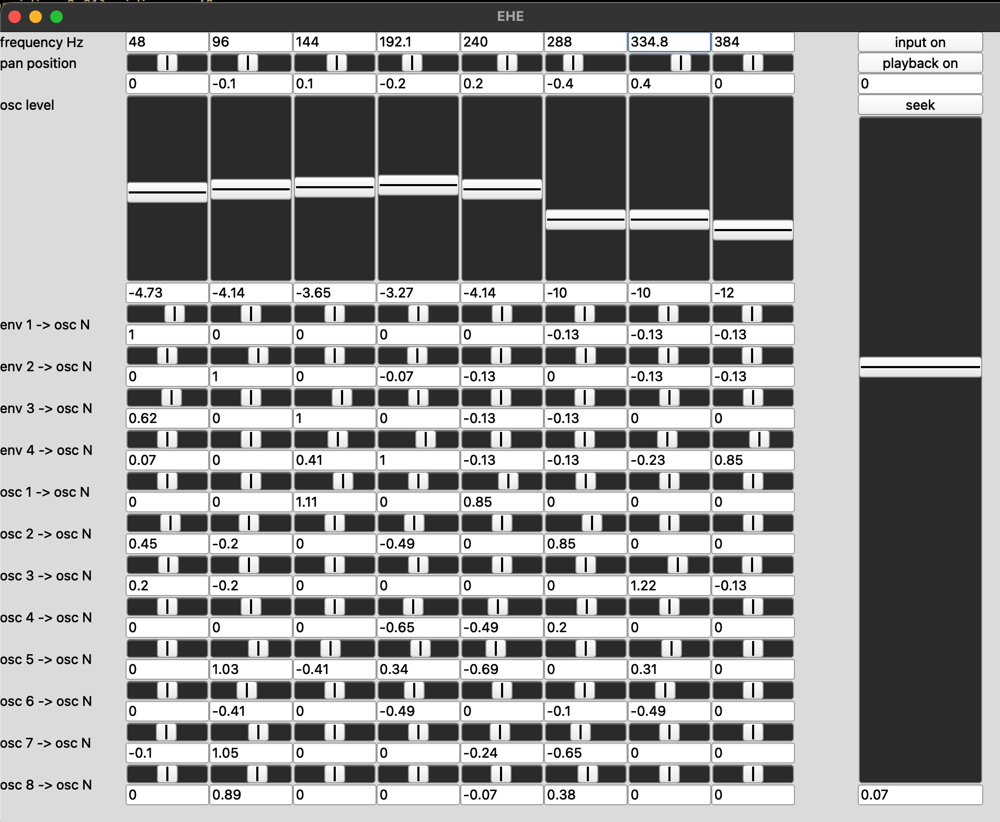
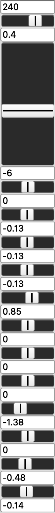
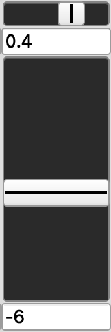
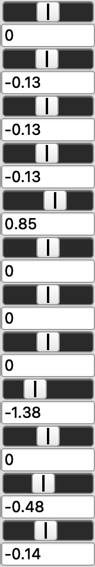
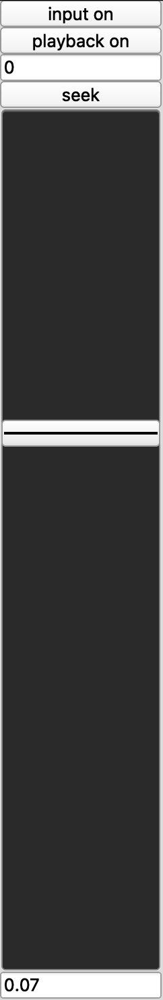
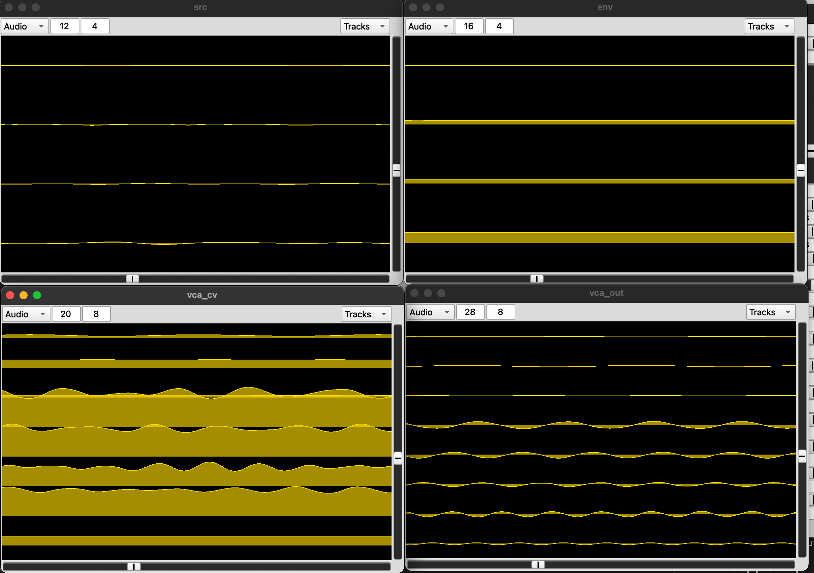
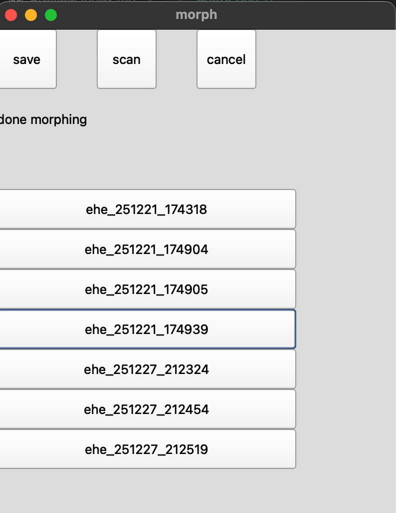

# ehe-sc : user interface guide

## editor window

### channel controls

These are arranged in columns, one per oscillator. Each column contains controls affecting a single oscillator `N`.

#### tuning controls

A number-box allows direct entry of frequency in Hz for oscillator `N`. Can also be clicked and dragged.

#### mix controls

- pan position slider
- pan position number-box (in [-1, 1])
- volume slider 
- volume number-box (in dBu)

#### modulation controls

Amplitude modulation of the 8 oscillators is performed in a `(M+N)xN` matrix, where `M` is the number of inputs/envelopes, and `N` is the number of oscillators. Presently this is a 12x8 matrix, for 4 inputs and 8 oscillators; the first 4 inputs to the matrix are the envelope signals, and the following 8 are signals coming from the VCAs after modulation is applied. Feedback paths are thus possible.

Modulation sliders, like pan sliders, are bidirectional:

- at the center, the modulator does not contribute to the amplitude of the carrier
- at 100% right, the full amount of the modulator signal is *added* to the amplitude of the carrier (potentially with gain)
- at 100% left, the modulation is *inverted*: the modulator is subtracted from the carrier's level, and a proportional constant offset is added.

### main controls

The right side of the editor window contains global controls:

- `input` / `playback` toggle buttons: mute/unmute the corresponding sources
- seek position number-box: set a position in seconds, to which the playback files will seek
- seek button: perform a seem to the indicated position
- main volume slider
- main volume number-box (in dBu)

## scope windows

There are 4 "scope" windows showing multi-channel, oscilloscope-style displays of various signals in the system. These are:

- **`src`** : source signals, live input and/or playback (one channel per input)
- **`env`** : "control-voltage" envelopes derived from `src` amplitudes (one channel per input)
- **`vca_cv`** : "control-voltage" inputs for virtual VCA nodes (1 channel per oscillator)
- **`vca_out`** : output of each oscillator after amplitude modulation

## preset / morph window

- `save` : perform a "quick save" of the current state of the synth, stored in the pre-determined _preset directory_. (currently `~/Desktop/earth_horns/ehe-presets`.) the filename will be generated from a timestamp, such as `ehe_251221_174318.scd`. 
- `scan` : lists all files in the preset directory, and creates a button corresponding to each one
- `cancel` : stop morphing

At the bottom of this window are the morph buttons. each of these corresponds to a discovered preset file. Pressing the button initiates a _morph_ to the parameter state described by the file:

- synth parameters and UI state will be updated every _time step_ (currently **0.1s**),
- performing a linear interpolation between the current,
- completing the change over the _morph time_ duration (currently **100s**)

Morphing affects: 
- each oscillator pitch, output level, pan position
- all modulation levels

It does **not** affect the output level of the main mix.

Other things to note:

- At present, the time step and morph time are not adjustable! This will be addressed shortly.

- Editor controls do not work properly during a morph, as morphing values overwrite control values. Use the `cancel` button if you want to edit the values before a morph is complete.

- We plan on replacing the glissando behavior with a crossfade.
